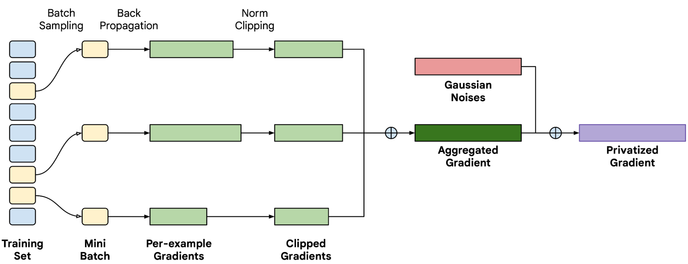
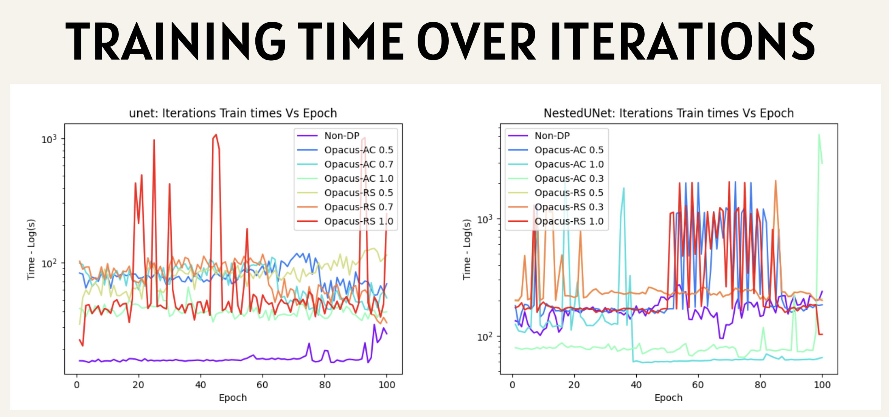
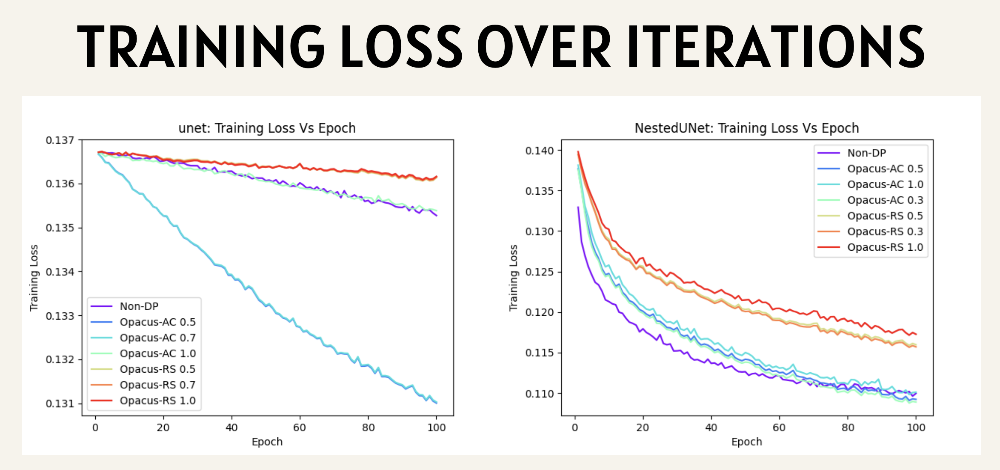
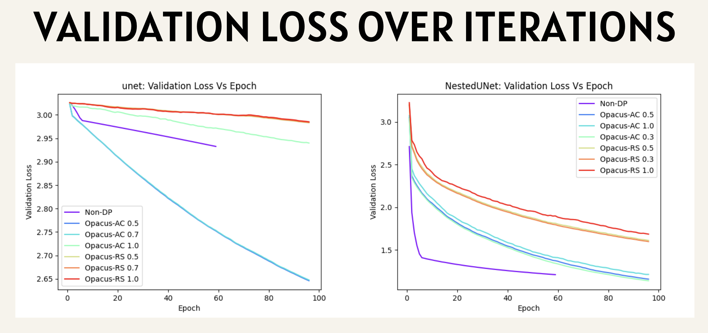
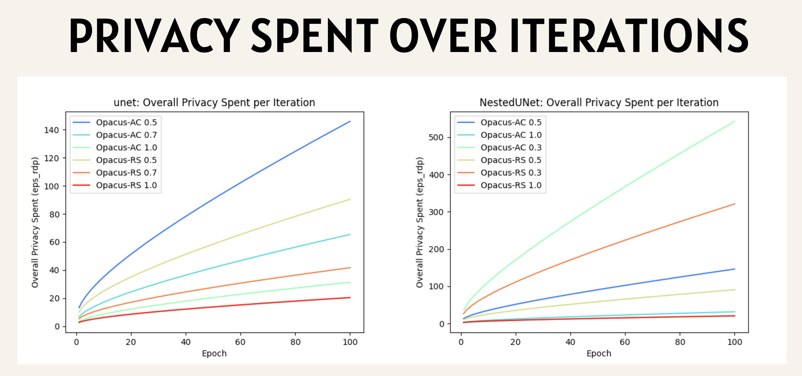
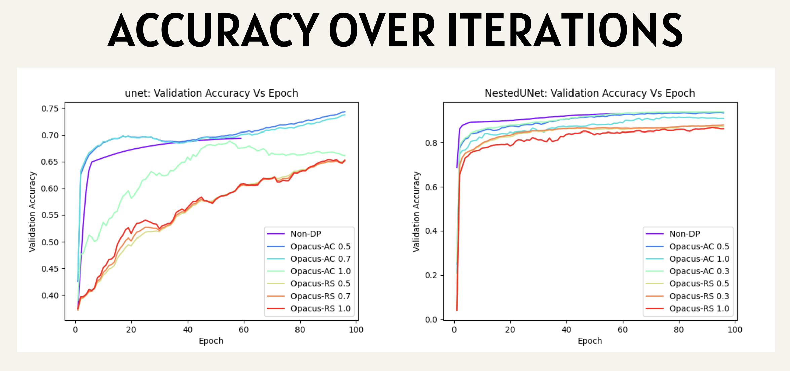

# PrivOCT: Differentially Private Retinal Layer Segmentation

### A Comparative Study of Automatic Clipping and Random Sparsification in DP-SGD

<p align="left">
  
  
  
 
</p>

---

## Abstract

Differentially Private Stochastic Gradient Descent (DP-SGD) is the standard recipe for training neural networks with formal privacy guarantees, but its utility depends critically on how per-example gradients are clipped and perturbed. In practice, the clipping threshold *R* is a sensitive hyperparameter: too large and the injected noise swamps the signal, too small and the gradient is over-attenuated. This work presents an empirical comparison of two techniques that address this problem from different directions: **Automatic Clipping (AC)**, which replaces threshold tuning with per-sample gradient normalization, and **Random Sparsification (RS)**, which randomly zeroes a growing fraction of gradient coordinates before clipping and noising. We evaluate both on a **medical imaging task** — nine-class retinal layer segmentation of Optical Coherence Tomography (OCT) B-scans from the Duke dataset — using two architectures (**U-Net** and **Nested U-Net / UNet++**) and four noise multipliers, against a non-private baseline.

On the Nested U-Net, AC matches or exceeds the non-private baseline in validation Dice (0.564 and 0.534 at noise multipliers 0.3 and 0.5, versus 0.474 non-private), while RS lags substantially (0.229–0.280) and produces visibly fragmented layer boundaries. The plain U-Net did not converge under our shared optimization settings, so its results should be read as a training-dynamics observation rather than an architectural comparison. We also report several methodological caveats — most importantly that the privacy budgets of AC and RS were accounted over different numbers of optimizer steps and are therefore **not directly comparable** — and describe them in [Limitations](#7-limitations-and-threats-to-validity).

**Keywords:** differential privacy, DP-SGD, automatic clipping, random sparsification, medical image segmentation, optical coherence tomography, U-Net, Opacus.

---

## Table of Contents

1. [Introduction](#1-introduction)
2. [Background and Methods](#2-background-and-methods)
3. [Experimental Setup](#3-experimental-setup)
4. [Results](#4-results)
5. [Discussion](#5-discussion)
6. [Conclusion and Future Work](#6-conclusion-and-future-work)
7. [Limitations and Threats to Validity](#7-limitations-and-threats-to-validity)
8. [Reproducibility](#8-reproducibility)
9. [Repository Structure](#9-repository-structure)
10. [References](#10-references)

---

## 1. Introduction

Medical images are among the most sensitive data a model can be trained on, and deep networks are known to memorize and leak information about their training examples. Differential privacy (DP) offers a rigorous, quantifiable defence: a training procedure is (ε, δ)-differentially private if its output distribution changes by at most a factor of *e<sup>ε</sup>* (plus a small slack δ) when any single individual's data is added or removed [Dwork & Roth, 2014].

DP-SGD [Abadi et al., 2016] achieves this by modifying ordinary SGD in three steps: (i) compute a gradient **per example**, (ii) **clip** each per-example gradient to a maximum norm *R*, and (iii) add **Gaussian noise** scaled to *R* before the update.


*Figure 1. Overview of DP-SGD. A mini-batch is sampled at each step and per-example gradients are computed. These are clipped, aggregated, and perturbed with Gaussian noise to produce the privatized gradient.*

### 1.1 Problem statement

Three practical difficulties make DP-SGD hard to use well:

1. **Threshold selection.** The clipping threshold *R* must be tuned. If *R* is too large, more noise is required relative to the signal; if it is too small, useful gradient information is discarded.
2. **Computational cost.** Per-sample clipping requires individual gradients for every example, which is substantially more expensive than ordinary batch gradients.
3. **Noise calibration.** The noise added after clipping controls the privacy–utility trade-off and must be chosen deliberately.

### 1.2 Research questions

This project investigates the following questions on a real medical segmentation task:

- **RQ1 (Utility).** How does each technique — Automatic Clipping and Random Sparsification — affect segmentation quality relative to non-private training?
- **RQ2 (Privacy–utility trade-off).** How does the noise multiplier σ affect utility and the accumulated privacy budget ε for each technique?
- **RQ3 (Cost).** What computational overhead does each technique impose?
- **RQ4 (Architecture).** Does the answer depend on model capacity (U-Net vs. Nested U-Net)?

### 1.3 Contributions

- A side-by-side implementation of non-private, AC-based DP, and RS-based DP training of U-Net and Nested U-Net on the same data, optimizer, and schedule (Section 3).
- An evaluation on the Duke OCT dataset reporting Dice, pixel accuracy, loss, wall-clock cost, and ε across noise multipliers (Section 4).
- A transparent audit of the experimental pipeline that identifies where the comparison is and is not on equal footing (Section 7).

---

## 2. Background and Methods

### 2.1 Automatic Clipping (AC)

Standard DP-SGD clips each per-sample gradient **g**<sub>i</sub> with the factor min(1, *R*/‖**g**<sub>i</sub>‖). Automatic Clipping [Bu et al., 2022] replaces this with a *normalization*:

```
C_i = R / (‖g_i‖ + γ)          (with a small stability constant γ, e.g. 0.01)
```

so that every per-sample gradient is rescaled to (approximately) a fixed norm. The threshold *R* then acts only as a constant multiplier that is absorbed into the learning rate, which **removes *R* as an independent hyperparameter**. The authors show that this variant is as private and as computationally efficient as standard DP optimizers while requiring no DP-specific tuning.

**In this repository:** AC is provided by a modified fork of Opacus (pinned in [`requirements-ac.txt`](requirements-ac.txt)) and is used through the standard `PrivacyEngine.make_private(...)` interface in [`train_with_ac_opacus.py`](code/train_with_ac_opacus.py).

### 2.2 Random Sparsification (RS)

Random Sparsification [Zhu & Blaschko, 2021] randomly zeroes a subset of gradient coordinates **before** clipping and noising. The authors' convergence analysis shows that, when the injected noise dominates the error bound, sparsifying reduces the noise-related term and can tighten the bound; they also note that the resulting sparse gradients reduce communication cost and hinder gradient-reconstruction attacks.

**In this repository** ([`train_with_rs_opacus.py`](code/train_with_rs_opacus.py)), RS is implemented explicitly in the training loop:

- A random index set of size `⌊rate × num_params⌋` is drawn each step with `torch.randperm`, and those gradient coordinates are set to zero.
- The **sparsified** gradient is clipped to norm *R* (flat clipping using the first entry of `max_grad_norm`).
- Gaussian noise with standard deviation `σ · R / batch_size` is added, and the noise is **masked with the same index set**, so noise is only injected into retained coordinates.
- The sparsity `rate` follows a **gradual-cooling schedule** ramping up to `final_rate = 0.9`, with the mask re-randomized `refresh = 2` times per epoch.
- Gradients from `batch_partitions = 2` consecutive mini-batches are accumulated before each optimizer step to reduce the memory footprint.

The Opacus `PrivacyEngine` is still attached to RS runs so that the privacy accountant can report ε.

### 2.3 Summary of compared configurations

| Configuration | Clipping | Sparsification | Noise | Privacy accounting |
|---|---|---|---|---|
| **Non-DP** | none | none | none | — |
| **Opacus-AC** | automatic (per-layer mode) | none | Gaussian (σ) | Opacus RDP accountant |
| **Opacus-RS** | flat, threshold *R* = 1.0 | random, rate → 0.9 | Gaussian (σ), masked | Opacus RDP accountant |

---

## 3. Experimental Setup

### 3.1 Task and dataset

The task is **nine-class semantic segmentation of retinal layers** in OCT B-scans. We use the Duke OCT dataset (Chiu et al., 2015) [[data](./data/DukeData/)], in which each subject contributes 11 manually annotated B-scans. Data are split **by subject**:

| Split | Subjects | B-scans |
|---|---|---|
| Train | 1 – 6 | 66 |
| Validation | 7 – 8 | 22 |
| Test | 9 – 10 | 22 |

Splitting by subject prevents scans from the same eye appearing in both training and evaluation. Preprocessing ([`preprocessing.py`](code/preprocessing.py), [`octprocessing.py`](code/octprocessing.py)) converts the original `.mat` volumes into per-B-scan `.npy` image/mask pairs. At load time ([`data.py`](code/data.py)) images are resized to a square resolution (default 224 × 224), z-score normalized (μ = 46.3758, σ = 53.9434), and masks are remapped so that the "region below RPE" label is folded into background and the fluid label becomes class 8. The remaining classes are:

| ID | Class |
|---|---|
| 0 | Background / region above retina |
| 1 | ILM: inner limiting membrane |
| 2 | NFL–IPL: nerve fiber ending to inner plexiform layer |
| 3 | INL: inner nuclear layer |
| 4 | OPL: outer plexiform layer |
| 5 | ONL–ISM: outer nuclear layer to inner segment myeloid |
| 6 | ISE: inner segment ellipsoid |
| 7 | OS–RPE: outer segment to retinal pigment epithelium |
| 8 | Fluid |

### 3.2 Models

Both networks replace Batch Normalization with **Group Normalization**, since Batch Normalization mixes statistics across examples and is incompatible with per-example gradient computation.

| Model | Description | Parameters (approx.) |
|---|---|---|
| **U-Net** [Ronneberger et al., 2015] | Encoder–decoder with 4 down/up-sampling levels, 32 initial features, skip connections | ≈ 7.8 M |
| **Nested U-Net (UNet++)** [Zhou et al., 2018] | Dense nested skip pathways over filters [32, 64, 128, 256, 512] | ≈ 9.2 M |

### 3.3 Loss and metrics

- **Loss:** `CombinedLoss` = pixel-wise cross-entropy + Dice loss.
- **Mean Dice** (primary metric): per-class Dice averaged over the 9 classes on the validation set.
- **Pixel accuracy:** fraction of correctly labelled pixels.
- **Validation loss**, **wall-clock time per epoch**, and **privacy budget ε** (at δ = 10<sup>-5</sup>) are also recorded.

> **Note on metrics.** Pixel accuracy is dominated by large, easy regions (background and thick layers) and can look high even when small classes are segmented poorly. Mean Dice is therefore the more informative measure of segmentation quality here.

### 3.4 Hyperparameters

All methods share the same optimizer and schedule so that differences are attributable to the privacy technique.

| Setting | Value |
|---|---|
| Optimizer | SGD |
| Learning rate | 5 × 10<sup>-4</sup> |
| Weight decay | 1 × 10<sup>-4</sup> |
| Batch size | 10 |
| Epochs | 100 |
| Seed | 7 |
| Hardware | CPU |

**Differential-privacy settings**

| Setting | Value |
|---|---|
| Target δ | 1 × 10<sup>-5</sup> |
| Clipping threshold *R* (`max_grad_norm`) | 1.0 |
| Clipping mode | per-layer |
| Noise multipliers σ | see grid below |

**Random Sparsification settings**

| Setting | Value |
|---|---|
| Final sparsification rate | 0.9 |
| Mask refresh (per epoch) | 2 |
| Batch partitions | 2 |

### 3.5 Experimental grid

The noise multipliers evaluated differ between the two architectures:

| Model | Non-DP | Opacus-AC σ | Opacus-RS σ |
|---|---|---|---|
| U-Net | ✔ | 0.5, 0.7, 1.0 | 0.5, 0.7, 1.0 |
| Nested U-Net | ✔ | 0.3, 0.5, 1.0 | 0.3, 0.5, 1.0 |

This yields 14 training runs in total (2 non-private + 12 private), each using a single seed.

---

## 4. Results

All numbers below are extracted directly from the run logs in [`results/`](results/) and correspond to the **final (100th) epoch**. Validation Dice and accuracy are computed on the validation split.

### 4.1 Headline results

| Model | Method | σ | Val. Dice ↑ | Val. Acc. (%) ↑ | Val. Loss ↓ | ε at δ=10⁻⁵ |
|---|---|---|---|---|---|---|
| **Nested U-Net** | Non-DP | — | 0.474 | 93.09 | 1.211 | — |
| | Opacus-AC | 0.3 | **0.564** | 93.93 | 1.140 | 542.7 |
| | Opacus-AC | 0.5 | 0.534 | 93.39 | 1.159 | 146.0 |
| | Opacus-AC | 1.0 | 0.403 | 90.87 | 1.214 | 31.3 |
| | Opacus-RS | 0.3 | 0.280 | 87.91 | 1.599 | 321.1 |
| | Opacus-RS | 0.5 | 0.249 | 87.11 | 1.613 | 90.5 |
| | Opacus-RS | 1.0 | 0.229 | 86.18 | 1.686 | 20.4 |
| **U-Net** | Non-DP | — | 0.162 | 69.39 | 2.933 | — |
| | Opacus-AC | 0.5 | 0.214 | 74.34 | 2.646 | 146.0 |
| | Opacus-AC | 0.7 | 0.211 | 73.75 | 2.648 | 65.3 |
| | Opacus-AC | 1.0 | 0.147 | 66.14 | 2.940 | 31.3 |
| | Opacus-RS | 0.5 | 0.146 | 65.20 | 2.983 | 90.5 |
| | Opacus-RS | 0.7 | 0.143 | 65.11 | 2.984 | 41.7 |
| | Opacus-RS | 1.0 | 0.141 | 65.28 | 2.985 | 20.4 |

> **Caveat on ε.** ε values for AC and RS should **not** be compared against each other directly; see [Section 7](#7-limitations-and-threats-to-validity).

**Change in Nested U-Net Dice relative to non-private training (0.474):**

| Method | σ = 0.3 | σ = 0.5 | σ = 1.0 |
|---|---|---|---|
| Opacus-AC | **+18.8 %** | **+12.5 %** | −15.0 % |
| Opacus-RS | −40.9 % | −47.4 % | −51.7 % |

### 4.2 Qualitative results

Predicted segmentations for the same validation slice (Nested U-Net, σ = 0.3) show the difference between methods. AC produces smooth, coherent layer boundaries close to the non-private model. RS produces speckled layer interiors with fragmented labels. Neither private method recovers the small fluid region present in the ground truth. All per-slice predictions are stored under [`results/`](results/) (`Predicted Duke Segment: N.png`).

### 4.3 Training time


*Figure 2. Wall-clock time per epoch (log scale) for U-Net (left) and Nested U-Net (right).*

**Observations**

- Nested U-Net is far more expensive per epoch than U-Net (median ≈ 166 s vs. ≈ 16 s in the non-private setting), as expected from its denser architecture.
- For **U-Net**, where timings are stable, DP training costs roughly **2.5×–5×** the non-private time (median epoch time), with RS slightly slower than AC at the same σ.
- For **Nested U-Net**, per-epoch times are very noisy, with spikes of 10<sup>3</sup>–10<sup>4</sup> s and abrupt level shifts within single runs. Some AC runs appear faster than the non-private baseline, which is not physically plausible for an algorithm that performs strictly more work per step.

**Interpretation.** The dispersion and step-changes are characteristic of CPU contention on shared hardware rather than of algorithmic cost. The noise multiplier only scales the variance of the injected noise and has no effect on computation, so differences in time across σ should not be attributed to the method. We therefore draw no conclusion about the relative speed of AC and RS from the Nested U-Net timings; the U-Net measurements indicate that DP overhead is a small constant factor.

### 4.4 Training loss


*Figure 3. Training loss versus epoch for U-Net (left) and Nested U-Net (right).*

**Observations**

- On Nested U-Net the ordering is **Non-DP ≈ AC < RS**: all AC runs converge onto the non-private curve by roughly epoch 80, ending at 0.109–0.110 versus 0.110 for Non-DP. RS remains higher (≈ 0.116–0.117).
- The AC/Non-DP gap is within run-to-run variation, so the defensible statement is that AC **matches** non-private training loss rather than beating it.

**Interpretation.** AC's normalization keeps every per-sample gradient at a consistent scale, which limits the distortion introduced by clipping. RS discards up to 90 % of gradient coordinates each step, which slows optimization and yields a higher training loss.

> **Note.** The plotted "training loss" is a summary statistic recorded per epoch; see [Section 7](#7-limitations-and-threats-to-validity) for how it is computed and how it affects the scale of these curves.

### 4.5 Validation loss


*Figure 4. Validation loss for U-Net (left) and Nested U-Net (right). The x-axis indexes evaluation points.*

**Observations**

- On Nested U-Net, non-private training reaches a low validation loss quickly, while AC descends more gradually and ends slightly below the final non-private value (1.14–1.16 vs. 1.21 for σ ≤ 0.5). RS ends substantially higher (1.60–1.69).
- On U-Net, AC with σ ∈ {0.5, 0.7} attains lower validation loss than the non-private baseline (2.65 vs. 2.93), but all U-Net losses remain high in absolute terms.

**Interpretation.** The Non-DP and DP curves are not sampled at identical epochs (Section 7), so the "AC ends below Non-DP" comparison should be read as indicative. The larger, more expressive Nested U-Net benefits from the stabilizing effect of normalized, noisy updates. The fact that non-private training converges much faster early on suggests that the DP runs are still improving at epoch 100 and were not trained to convergence.

### 4.6 Privacy spent


*Figure 5. Accumulated privacy budget ε (RDP accountant, δ = 10⁻⁵) for U-Net (left) and Nested U-Net (right).*

**Observations**

- ε grows monotonically with training and **decreases as the noise multiplier increases**: for AC, ε at epoch 100 falls from 542.7 (σ = 0.3) to 146.0 (σ = 0.5), 65.3 (σ = 0.7) and 31.3 (σ = 1.0).
- The Nested U-Net panel spans a larger y-range only because it includes σ = 0.3, which was not run for U-Net.
- For a given σ and method, **ε is identical for U-Net and Nested U-Net** (e.g. AC σ = 0.5 gives 146.0 for both).

**Interpretation.** The RDP accountant depends only on the noise multiplier, the sampling rate (10/66), and the number of accounted steps. It is independent of model architecture, so differences in ε between panels arise from the *choice of σ*, not from model complexity. Larger σ injects more noise per step and therefore consumes less privacy budget.

### 4.7 Accuracy


*Figure 6. Validation pixel accuracy versus evaluation index for U-Net (left) and Nested U-Net (right).*

**Observations**

- On Nested U-Net, AC with σ ∈ {0.3, 0.5} reaches 93.4–93.9 %, marginally above the non-private 93.1 %; AC with σ = 1.0 reaches 90.9 % and RS reaches 86–88 %.
- On U-Net, AC with σ ∈ {0.5, 0.7} rises to 74 % and finishes above the non-private baseline (69 %), and it reaches a high accuracy earlier in training than the non-private run.

**Interpretation.** High accuracy on U-Net coexists with a very low mean Dice (0.14–0.21): the plain U-Net predicts the large, easy regions correctly while segmenting most thin layers poorly. This is the reason mean Dice, not accuracy, is treated as the primary metric.

---

## 5. Discussion

**RQ1 — Utility.** AC preserves, and in this experiment slightly exceeds, the utility of non-private training on the Nested U-Net at low-to-moderate noise (Dice 0.564 / 0.534 vs. 0.474), and degrades gracefully at σ = 1.0 (0.403). RS is consistently and substantially worse (Dice 0.229–0.280) and yields visibly noisier segmentations. At matched σ on the Nested U-Net, AC leads RS by 0.28 Dice at σ = 0.3 and 0.5, and by 0.17 at σ = 1.0.

**A possible explanation for AC exceeding Non-DP.** A DP-trained model outperforming its non-private counterpart is unusual and warrants caution. Two factors plausibly contribute. First, the models were trained with plain SGD at a small learning rate for a fixed budget of 100 epochs on only 66 training slices, so the non-private run is not guaranteed to be at its optimum. Second, normalization and noise act as regularizers that may help on such a small dataset. With a single seed and no confidence intervals we cannot separate these effects from run-to-run variance, so we interpret the result as "AC is competitive with non-private training" rather than as evidence that privacy improves accuracy.

**Why RS underperforms here.** RS was designed to help when the noise term dominates the convergence bound, and its reported benefits come from settings such as large models with many parameters. In our setup the sparsification rate is scheduled up to 0.9, meaning the model is trained on a heavily masked gradient for much of the run, on a very small dataset. This slows optimization and is consistent with the elevated training and validation loss and with the speckled predictions in Section 4.2. We did not sweep `final_rate`, so we cannot say whether a lower target sparsity would close the gap.

**RQ2 — Privacy–utility trade-off.** Increasing σ lowers ε but also lowers utility for both methods. For AC on Nested U-Net, Dice falls from 0.564 to 0.403 as σ rises from 0.3 to 1.0 while ε falls from 542.7 to 31.3. Importantly, the absolute ε values in this study (20 to 543) are large by the standards of meaningful privacy guarantees (typically ε ≲ 10), so these results characterize the *relative* behavior of the techniques rather than deployable privacy levels.

**RQ3 — Cost.** On the stable U-Net measurements, DP training imposes an overhead of roughly 2.5×–5× per epoch over non-private training, with RS a little slower than AC at equal σ. The Nested U-Net timings are too noisy to support a comparison (Section 4.3).

**RQ4 — Architecture.** The Nested U-Net achieves far higher Dice than the U-Net in every setting (e.g. 0.474 vs. 0.162 non-private). This gap should not be interpreted as a pure architecture effect: the U-Net barely trained under the shared optimizer settings — its training loss decreased by only ≈ 1–12 % over 100 epochs, compared with ≈ 46–62 % for the Nested U-Net. The observation that AC helps the U-Net *more* in relative terms (≈ +31 % to +32 % Dice) is therefore likely tied to this under-training and should be re-examined with a learning rate tuned for the U-Net.

---

## 6. Conclusion and Future Work

We compared Automatic Clipping and Random Sparsification as DP-SGD variants for privacy-preserving OCT layer segmentation. In this study, **Automatic Clipping consistently outperforms Random Sparsification**, is competitive with non-private training on the Nested U-Net at low-to-moderate noise, and removes the need to tune the clipping threshold. Random Sparsification, as configured here, incurs a large utility penalty. The privacy–utility trade-off is governed by the noise multiplier, and the largest utility is obtained at the largest accumulated ε.

**Key takeaway:** for this task, AC combined with a moderate noise multiplier offers the best privacy–utility trade-off among the evaluated options, while RS requires further tuning before it is competitive.

**Future work**

- **Statistical rigor:** repeat runs across multiple seeds and report mean ± standard deviation; apply K-fold cross-validation (a K-fold data loader is already provided in [`data.py`](code/data.py)) and evaluate on the held-out test split.
- **Fair privacy comparison:** account both methods over the same number of optimizer steps, and compare utility at **matched ε** rather than matched σ.
- **Stronger privacy regimes:** evaluate at ε ≤ 10 by increasing σ or reducing steps.
- **Tuning:** sweep the RS `final_rate` and `refresh`, and tune the learning rate per architecture (notably for U-Net).
- **Broader evaluation:** additional datasets (e.g. the UMN OCT dataset, for which preprocessing support already exists), per-class Dice reporting, and boundary-aware metrics.
- **Correct wall-clock benchmarking** on a dedicated GPU/CPU to obtain reliable cost comparisons.

---

## 7. Limitations and Threats to Validity

We document the following issues so that the results above can be interpreted correctly. None of them changes the qualitative ranking (AC > RS), but several limit how strongly the numbers can be used.

1. **ε is not comparable between AC and RS.** The RS training loop steps the optimizer once per `batch_partitions = 2` mini-batches, whereas the AC loop steps every mini-batch. The RDP accountant therefore recorded roughly **twice as many steps for AC (≈ 700) as for RS (≈ 350)**, which is why RS reports a lower ε at equal σ (e.g. 90.5 vs. 146.0 at σ = 0.5). Comparisons of ε across methods therefore reflect this difference in accounted steps, not an intrinsic privacy advantage of RS. Furthermore, for RS the clipping and noising are performed manually in the training loop while the Opacus engine is used only for accounting, so the reported ε should be regarded as an approximation of the true guarantee for that configuration.
2. **Training-loss statistic.** The per-epoch "training loss" is accumulated as `total_loss = loss.item() + img.size(0)` and divided by the number of samples. This reflects the **last mini-batch loss plus the last batch size**, not a true epoch average, and adds a large constant offset (≈ 0.09) that compresses the vertical range of the training-loss curves. The *relative ordering* of methods is preserved, but absolute values and the visual gaps in Figure 3 should not be over-interpreted. Validation metrics are computed correctly over the full validation set.
3. **Misaligned validation schedules.** Non-private runs are evaluated when `epoch % 10 == 0 or epoch > 45` (59 evaluations); DP runs when `epoch % 10 == 0 or epoch > 4` (96 evaluations). The x-axes of Figures 4 and 6 index *evaluation points*, not epochs, so Non-DP and DP curves are not aligned in real epochs. Only the final-epoch values in Section 4.1 are directly comparable.
4. **Under-trained U-Net.** The U-Net training loss barely moves over 100 epochs, so U-Net results do not reflect a converged model.
5. **Single seed, no confidence intervals.** Each configuration was run once (seed 7). Differences of the order of a few hundredths of Dice cannot be distinguished from noise.
6. **Model selection on the validation split; test split not reported.** Checkpoints are chosen by best validation Dice, and the same split is used for the reported metrics. The held-out test split is not evaluated in the reported results.
7. **Asymmetric noise grid.** U-Net and Nested U-Net were run with different noise multipliers (Section 3.5), so cross-architecture comparisons are only possible at σ = 0.5 and 1.0.
8. **Timing measured on shared CPU hardware.** See Section 4.3.
9. **Large privacy budgets.** With ε between 20 and 543, none of the configurations provides a strong privacy guarantee.
10. **Small dataset.** Ten subjects (110 B-scans) limit statistical power and generalization.

---

## 8. Reproducibility

### 8.1 Environment

```bash
# Baseline / Random Sparsification (stock Opacus)
pip install -r requirements.txt

# Automatic Clipping requires the modified Opacus fork
pip install -r requirements-ac.txt
```

`requirements.txt` pins `opacus==1.4.1`, `torchvision==0.18.1`, `scikit-learn==1.5.0`, `pandas==2.2.2`, `matplotlib==3.9.0`, and `tqdm==4.66.4`. Automatic Clipping uses a fork of Opacus pinned to a specific commit in `requirements-ac.txt`; install it in a **separate environment** from stock Opacus to avoid conflicts.

### 8.2 Data preparation (optional)

The preprocessed slices are provided under `data/DukeData/`. To regenerate them from the original Duke `.mat` files:

```bash
python code/preprocessing.py <path/to/mat_files> data/DukeData --dataset Duke
```

### 8.3 Training

Run all commands from the repository root.

```bash
# Non-private baseline
python code/train.py --model_name NestedUNet --num_iterations 100 --image_size 224

# Automatic Clipping (DP) — requires the AC fork environment
python code/train_with_ac_opacus.py --model_name NestedUNet \
    --noise_multiplier 0.5 --num_iterations 100 --clipping_mode per_layer

# Random Sparsification (DP)
python code/train_with_rs_opacus.py --model_name NestedUNet \
    --noise_multiplier 0.5 --num_iterations 100 \
    --final_rate 0.9 --refresh 2 --batch_partitions 2
```

Use `--model_name unet` for the U-Net. Each run appends a row of metrics to `results/<method>/<model>_Duke.csv` and saves plots and predicted segmentations under `results/`.

> **Note:** for Nested U-Net the per-layer `--max_grad_norm` list must match the number of parameter tensors (the code comment indicates `[1.0] * 122`). Adjust the default accordingly.

### 8.4 Aggregating results

```bash
python code/csv_insights.py
```

This reads the per-method CSVs and writes comparison plots to `results/csv_insights/`. Note that the script currently references `NestedUnet_Duke.csv`; the files on disk are named `NestedUNet_Duke.csv`, so the filename casing must match on case-sensitive filesystems.

### 8.5 Inference

```bash
python code/predict.py --model_path <path/to/checkpoint.pt> --data_path data/DukeData/test
```

`predict.py` transparently handles the `_module.` key prefix that Opacus adds to checkpoint keys.

---

## 9. Repository Structure

```
.
├── code/
│   ├── train.py                  # Non-private baseline
│   ├── train_with_ac_opacus.py   # DP training with Automatic Clipping
│   ├── train_with_rs_opacus.py   # DP training with Random Sparsification
│   ├── networks.py               # U-Net and Nested U-Net (GroupNorm)
│   ├── losses.py                 # Combined CE + Dice loss (and focal frequency loss)
│   ├── data.py                   # OCT dataset, transforms, loaders, K-fold utility
│   ├── preprocessing.py          # .mat -> .npy slicing pipeline
│   ├── octprocessing.py          # Layer-boundary -> dense mask conversion
│   ├── utils.py                  # Dice / mIoU metrics, label colouring
│   ├── csv_insights.py           # Aggregates run CSVs into comparison plots
│   └── predict.py                # Inference and visualization
├── data/DukeData/                # Preprocessed Duke OCT slices (train / val / test)
├── results/
│   ├── Non-DP/                   # Baseline runs
│   ├── opacus-ac/                # Automatic Clipping runs (per noise multiplier)
│   ├── Opacus-RS/                # Random Sparsification runs (per noise multiplier)
│   ├── csv_insights/             # Aggregate comparison plots
│   └── docs_results/             # Figures used in this README
├── notes/                        # Reference papers (AC and RS)
├── requirements.txt
└── requirements-ac.txt           # Opacus fork for Automatic Clipping
```

---

## 10. References

1. Abadi, M., Chu, A., Goodfellow, I. J., McMahan, H. B., Mironov, I., Talwar, K., & Zhang, L. (2016). *Deep Learning with Differential Privacy.* Proceedings of the 2016 ACM SIGSAC Conference on Computer and Communications Security.
2. Bu, Z., Wang, Y.-X., Zha, S., & Karypis, G. (2022). *Automatic Clipping: Differentially Private Deep Learning Made Easier and Stronger.* arXiv:2206.07136 (NeurIPS 2023).
3. Zhu, J., & Blaschko, M. B. (2021). *Improving Differentially Private SGD via Randomly Sparsified Gradients.* arXiv:2112.00845.
4. Yousefpour, A., Shilov, I., Sablayrolles, A., Testuggine, D., Prasad, K., Malek, M., Nguyen, J., Ghosh, S., Bharadwaj, A., Zhao, J., Cormode, G., & Mironov, I. (2021). *Opacus: User-Friendly Differential Privacy Library in PyTorch.* arXiv:2109.12298.
5. Altschuler, J. M., & Talwar, K. (2022). *Privacy of Noisy Stochastic Gradient Descent: More Iterations without More Privacy Loss.* arXiv:2205.13710.
6. Dwork, C., & Roth, A. (2014). *The Algorithmic Foundations of Differential Privacy.* Foundations and Trends in Theoretical Computer Science, 9(3–4), 211–407.
7. Ronneberger, O., Fischer, P., & Brox, T. (2015). *U-Net: Convolutional Networks for Biomedical Image Segmentation.* arXiv:1505.04597.
8. Zhou, Z., Siddiquee, M. M. R., Tajbakhsh, N., & Liang, J. (2018). *UNet++: A Nested U-Net Architecture for Medical Image Segmentation.* DLMIA 2018 / ML-CDS 2018, MICCAI 2018, Granada, Spain, LNCS 11045, 3–11.
9. Chiu, S. J., Allingham, M. J., Mettu, P. S., Cousins, S. W., Izatt, J. A., & Farsiu, S. (2015). *Kernel regression based segmentation of optical coherence tomography images with diabetic macular edema.* Biomedical Optics Express, 6(4), 1172–1194.
10. Iwanicka, M., Sylwestrzak, M., Szkulmowska, A., & Targowski, P. (2020). *Optical Coherence Tomography (OCT).* Van Gogh's Sunflowers Illuminated.
11. Automatic Clipping implementation (Opacus fork): <https://github.com/ParthS007/opacus/commit/6285a3beca36408e80cfb853d052d3a26247518e>

---

## License

Distributed under the GNU General Public License v3.0. See [`LICENSE`](LICENSE) for details.

---

_If you find a discrepancy in the results or observations, please open an issue._
